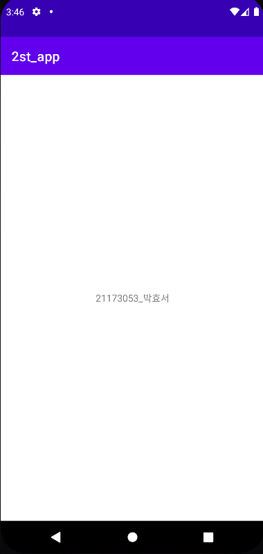
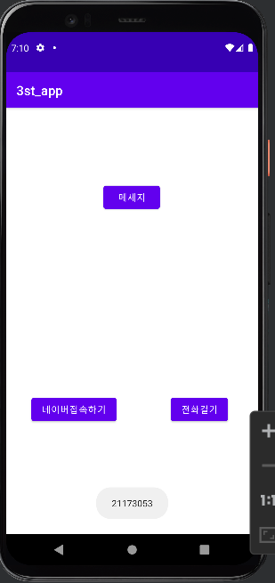
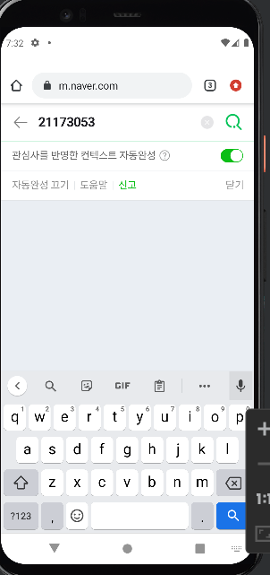
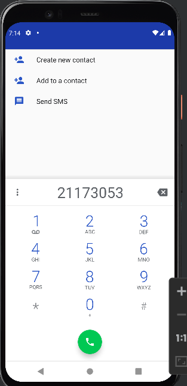
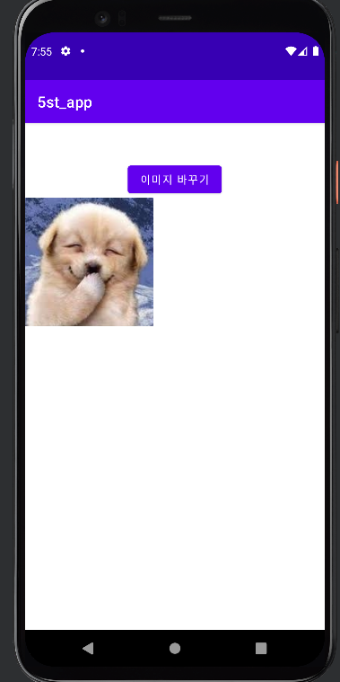
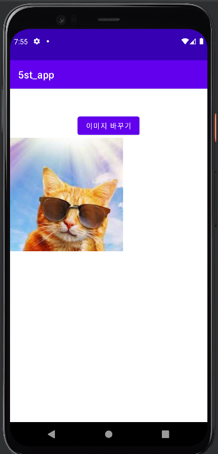
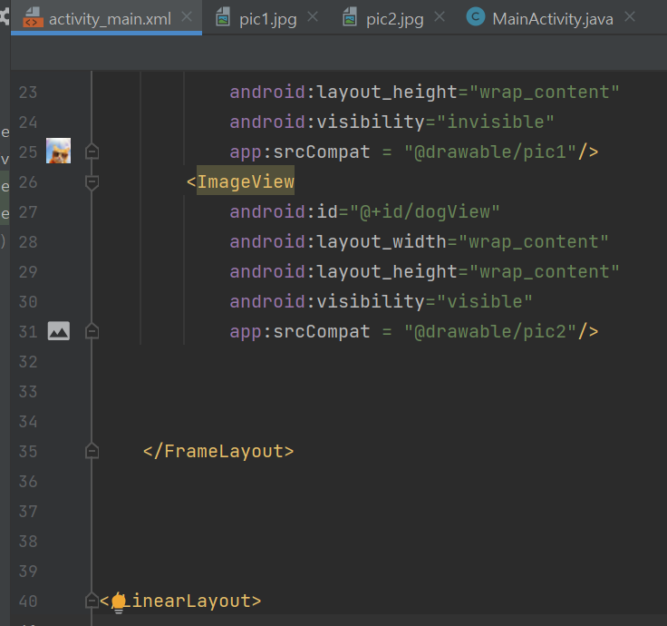
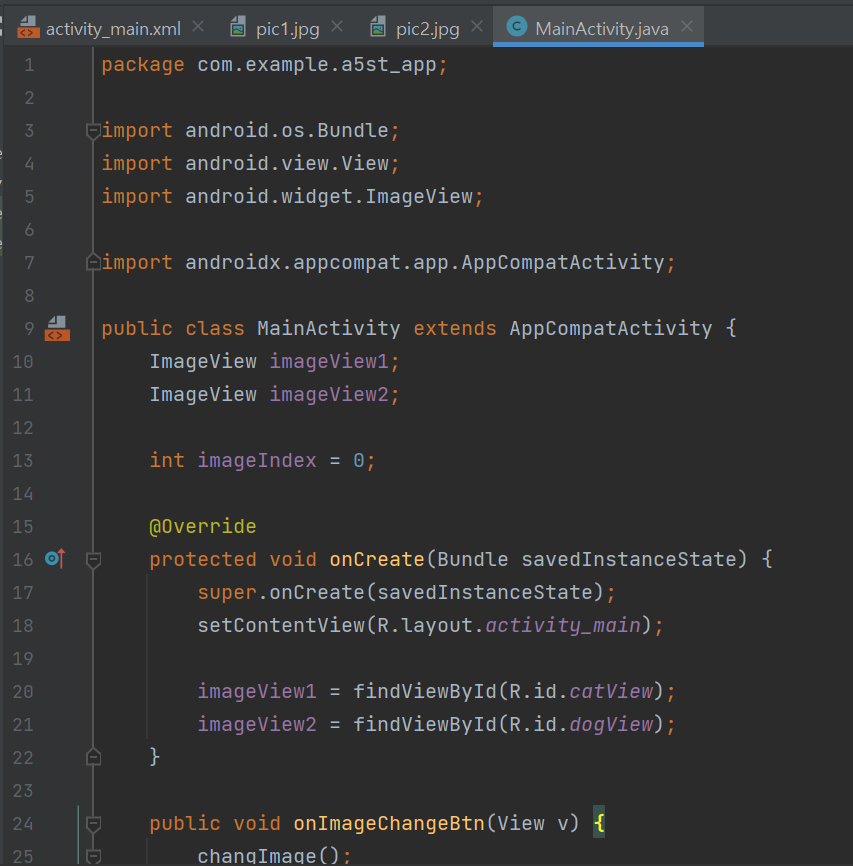
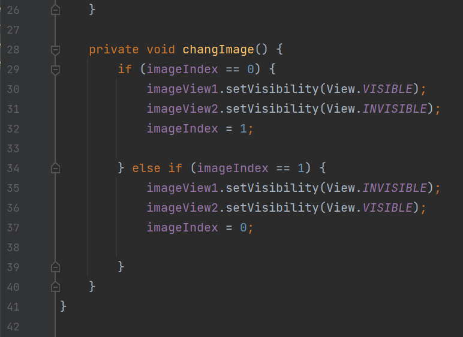

# 2주차 (2022-03-15)
- 안드로이드 스튜디오 설치 && 깃허브 가입 및 저장소 생성

</img>

## 3주차 과제
 </img>
 </img>
 </img>

##### 5주차 과제
 </img>
 </img>
 </img>
 </img>
 </img>
 </img>

###### 6주차 과제 
- 플랫폼 6주차 과제 제출
 </img>
 </img>
 </img>
 </img>
 </img>
 </img>
 </img>
 </img>
 </img>
